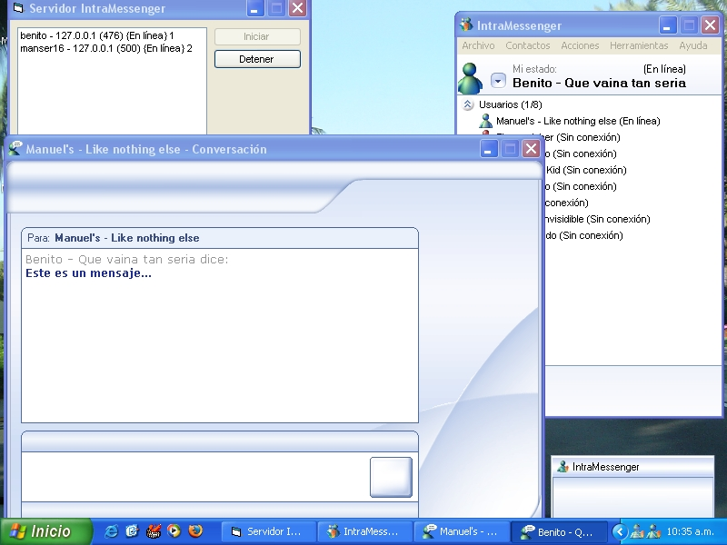



## Network communication system \(Intramessenger TCP/IP\) UPDATED\) See screenshot

### Description

Español: El propósito de este programa es establecer comunicacion entre computadoras de una misma red, al estilo del cliente MSN Messenger. Cuenta con dos componentes básicos, el servidor (donde se almacenan todas las configuraciones y se administra el servicio), y el cliente (quien se conecta al servidor.) Se han solucionado algunos problemas con esta versión y agregado varias funciones. NO TE OLVIDES DE VOTAR POR ESTE CÓDIGO!!!

 

English: This proyect allow you to estabilish communication between computers of a same network, this app works like the MSN Messenger client. This app have two basic components, the server (where all settings are stored and the service is administered), and the client (who connects to the server.) Some bugs fixed on this release, new features add. PLEASE VOTE!!! :) a multilanguage version comming soon!!!
 
### More Info
 

             |
---                |---
**Submitted On**   |2005-01-05 20:14:46
**By**             |[Manuel E\. Serrano I\.](https://github.com/Planet-Source-Code/PSCIndex/blob/master/ByAuthor/manuel-e-serrano-i.md)
**Level**          |Advanced
**User Rating**    |4.5 (50 globes from 11 users)
**Compatibility**  |VB 6\.0
**Category**       |[Complete Applications](https://github.com/Planet-Source-Code/PSCIndex/blob/master/ByCategory/complete-applications__1-27.md)
**World**          |[Visual Basic](https://github.com/Planet-Source-Code/PSCIndex/blob/master/ByWorld/visual-basic.md)
**Archive File**   |[Network\_co183731162005\.zip](https://github.com/Planet-Source-Code/manuel-e-serrano-i-network-communication-system-intramessenger-tcp-ip-updated-see-screensh__1-58138/archive/master.zip)

